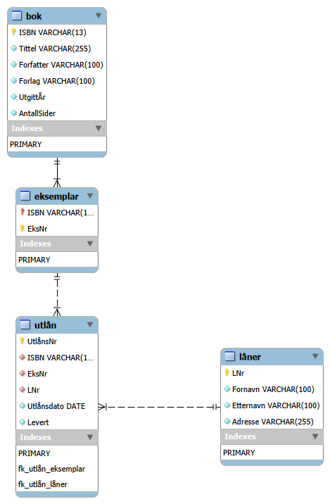

# Oppgave 2 – Dokumentasjon (README.md)

## 1. Oversikt over databasen
Databasen **ga_bibliotek** er utviklet for å administrere informasjon om bøker, eksemplarer, lånere og utlån ved et bibliotek.  
Strukturen følger prinsippene for **3. normalform (3NF)** og sikrer dataintegritet gjennom primær- og fremmednøkler.

---

## 2. Tabellbeskrivelser

### 2.1 `bok`
**Formål:** Inneholder grunnleggende informasjon om hver bok (tittel, forfatter, forlag osv.).  
**Primærnøkkel:** `ISBN`  
**Viktige felt:**
- `Tittel`, `Forfatter`, `Forlag` – tekstfelt som beskriver boka.
- `UtgittÅr`, `AntallSider` – numeriske verdier som gir detaljert informasjon.

**Begrunnelse:**  
`ISBN` brukes som unik identifikator fordi den er globalt unik for hver bokutgave.

---

### 2.2 `eksemplar`
**Formål:** Representerer hvert fysiske eksemplar av en bok som biblioteket eier.  
**Primærnøkkel:** `(ISBN, EksNr)`  
**Fremmednøkkel:** `ISBN` refererer til `bok(ISBN)`  
**Forklaring:**  
Kombinasjonen av ISBN og eksemplarnummer (`EksNr`) sørger for at hvert eksemplar er unikt identifisert, selv om flere eksemplarer finnes av samme bok.

---

### 2.3 `låner`
**Formål:** Inneholder personopplysninger om personer som låner bøker.  
**Primærnøkkel:** `LNr` (automatisk økende).  
**Forklaring:**  
Dette gjør det enkelt å koble lånere til deres utlån og opprettholde referanseintegritet.

---

### 2.4 `utlån`
**Formål:** Registrerer hvert utlån, inkludert dato og leveringsstatus.  
**Primærnøkkel:** `UtlånsNr` (automatisk økende).  
**Fremmednøkler:**
- `(ISBN, EksNr)` → `eksemplar(ISBN, EksNr)`
- `LNr` → `låner(LNr)`

**Forklaring:**  
Ved å bruke fremmednøkler sikres at utlån bare kan registreres for eksisterende bøker, eksemplarer og lånere.  
Feltet `Levert` bruker en **CHECK-konstraint** for å sikre at verdien alltid er enten `0` (ikke levert) eller `1` (levert).

---

## 3. Relasjonsoversikt
```
bok (ISBN) 1---∞ eksemplar (ISBN, EksNr)
eksemplar (ISBN, EksNr) 1---∞ utlån (UtlånsNr)
låner (LNr) 1---∞ utlån (LNr)
```

---

## 4. Designvalg og integritet
- **Dataintegritet:** Opprettholdes gjennom primær- og fremmednøkler samt CHECK-konstraint.  
- **Oppdatering og sletting:** `ON UPDATE CASCADE` sikrer at endringer i bokdata videreføres automatisk.  
- **Ytelse:** Indekser opprettes implisitt gjennom primærnøklene.  
- **Normalisering:** Datamodellen unngår redundans og følger 3NF.

---

## 5. Kildeskjema
*(Figur hentet fra Oppgave 2-skjema.png)*



## Vedlegg A – Kolonner, datatyper og constraints (eksplisitt)

**bok**
- `ISBN VARCHAR(13)` — **PRIMARY KEY**
- `Tittel VARCHAR(255)` — **NOT NULL**
- `Forfatter VARCHAR(100)` — **NOT NULL**
- `Forlag VARCHAR(100)` — **NOT NULL**
- `UtgittÅr INT` — **NOT NULL**
- `AntallSider INT` — **NOT NULL**

**eksemplar**
- `ISBN VARCHAR(13)` — **NOT NULL**, **FOREIGN KEY** → `bok(ISBN)`
- `EksNr INT` — **NOT NULL**
- **PRIMARY KEY** (`ISBN`, `EksNr`)

**låner**
- `LNr INT` — **PRIMARY KEY**, **AUTO_INCREMENT**
- `Fornavn VARCHAR(100)` — **NOT NULL**
- `Etternavn VARCHAR(100)` — **NOT NULL**
- `Adresse VARCHAR(255)` — **NOT NULL**

**utlån**
- `UtlånsNr INT` — **PRIMARY KEY**, **AUTO_INCREMENT**
- `ISBN VARCHAR(13)` — **NOT NULL**
- `EksNr INT` — **NOT NULL**
- `LNr INT` — **NOT NULL**
- `Utlånsdato DATE` — **NOT NULL**
- `Levert TINYINT` — **NOT NULL**, **CHECK (Levert IN (0,1))**
- **FOREIGN KEY** (`ISBN`, `EksNr`) → `eksemplar(ISBN, EksNr)`
- **FOREIGN KEY** (`LNr`) → `låner(LNr)`

**Merk**
- Alle tabeller bruker `utf8mb4` og `utf8mb4_unicode_ci`.
- Fremmednøkler er satt med `ON UPDATE CASCADE` og `ON DELETE RESTRICT` der det er relevant.
- `Levert` feltet modellerer status: 0 utlånt, 1 levert.


## Ytelse og indekser
For å sikre gode kjøretider ved spørringer på fremmednøkler, anbefales eksplisitte indekser på:
- `eksemplar(ISBN)`
- `utlån(ISBN, EksNr)`
- `utlån(LNr)`

I tillegg kan man vurdere indeks på `bok(Forfatter)` for søk etter forfatter.

> Merk: `CHECK (Levert IN (0,1))` håndheves i MySQL 8.0+. I eldre versjoner kan uttrykket være informativt uten å bli tvangsgjennomført.

