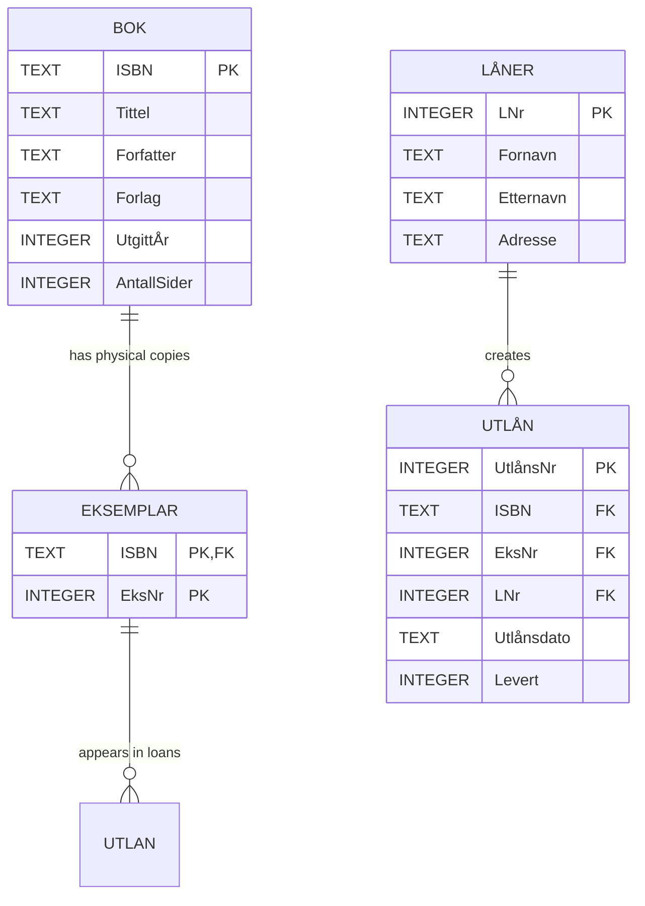

# Database design

The application uses a self-contained SQLite database. The schema is created
idempotently by `library_loans/database.py` on the first connection.

`EKSEMPLAR` uses `(ISBN, EksNr)` as its composite primary key because a copy
number is unique only within a book. `UTLAN` references both columns so every
loan belongs to a real physical copy and a real borrower.
